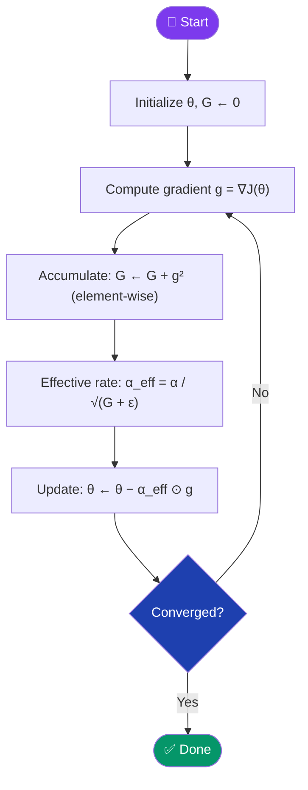
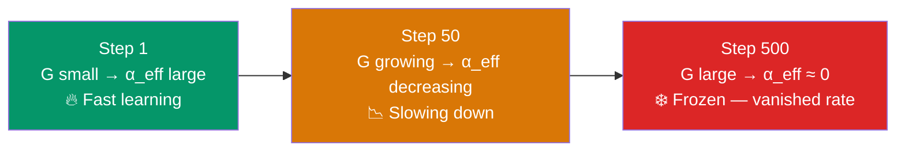

[← Back to README](../README.md)

# 📈 Adagrad (Adaptive Gradient Algorithm)

> **Year Introduced:** 2011 &nbsp;|&nbsp; **Category:** Momentum & Adaptive Learning Rate Variants

---

## Overview

**Adagrad** (Adaptive Gradient Algorithm) revolutionised optimisation by introducing **per-parameter adaptive learning rates**. Instead of using a single global learning rate, Adagrad adjusts the rate for each parameter individually — making larger updates for infrequent parameters and smaller updates for frequent ones. This makes it particularly powerful for sparse data like text and images.

Introduced by **Duchi, Hazan & Singer (2011)** at JMLR, Adagrad was a watershed moment in the development of modern deep learning optimizers.

---

## ⚙️ How It Works

1. **Initialize** parameters θ and accumulated gradient cache G = 0 (same shape as θ).
2. **Compute gradient** g = ∇J(θ).
3. **Accumulate squared gradients**: G ← G + g ⊙ g (element-wise square).
4. **Adapt learning rate per parameter**: divide α by √G (element-wise).
5. **Update parameters**: θ ← θ − (α / √(G + ε)) ⊙ g
6. **Repeat** — G grows monotonically, so the effective learning rate decreases over time.

The cache G accumulates the **historical sum of squared gradients** for each parameter. Parameters that received many large gradients get a small effective rate; parameters with rare, small gradients get a larger effective rate.

---

## 📐 Mathematical Formula

**Gradient accumulation:**
$$G_{t+1} = G_t + g_t \odot g_t$$

**Parameter update:**
$$\theta_{t+1} = \theta_t - \frac{\alpha}{\sqrt{G_{t+1} + \varepsilon}} \odot g_t$$

Where:
- $g_t = \nabla_\theta J(\theta_t)$ — gradient at step $t$
- $G_t \in \mathbb{R}^d$ — accumulated sum of squared gradients (per-parameter)
- $\varepsilon \approx 10^{-8}$ — small constant for numerical stability
- $\odot$ — element-wise (Hadamard) product
- $\alpha$ — global base learning rate (e.g., 0.01)

---

## 🔄 Algorithm Flow

---

## 📉 Learning Rate Decay Over Time

---

## ✅ Pros

| Advantage | Detail |
|---|---|
| **Per-parameter rates** | Rare features get large updates; frequent features get small updates. |
| **Great for sparse data** | NLP tasks, word embeddings, and sparse features benefit enormously. |
| **No learning rate schedule needed** | Rate naturally adapts without manual decay. |
| **Solid theory** | Comes with strong regret-bound guarantees (online learning framework). |

---

## ❌ Cons

| Disadvantage | Detail |
|---|---|
| **Vanishing learning rate** | G accumulates forever → effective rate → 0 → learning stops prematurely. |
| **Cannot restart adaptation** | Historical accumulated gradients are never forgotten. |
| **Poor for non-convex deep learning** | The vanishing rate problem makes it unsuitable for long training runs. |

---

## 🎯 When to Use

- ✔️ **Sparse NLP tasks** — training word embeddings, bag-of-words models
- ✔️ **Short training runs** where the vanishing rate problem doesn't manifest
- ✔️ **Logistic regression** on sparse features
- ✔️ **As a stepping stone** — understanding Adagrad is essential for understanding RMSprop and Adam
- ✖️ **Avoid** for deep networks trained for many epochs — use RMSprop or Adam instead

---

## 📖 First Paper / Origin

> **Duchi, J., Hazan, E., & Singer, Y. (2011).** *Adaptive Subgradient Methods for Online Learning and Stochastic Optimization.*
> Journal of Machine Learning Research (JMLR), 12, 2121–2159.
>
> 🔗 [Read on JMLR](https://jmlr.org/papers/v12/duchi11a.html)

This paper introduced adaptive learning rates to the field, proving regret bounds that show Adagrad can match the best fixed learning rate chosen in hindsight — a landmark result in online learning theory.

---

## 🔗 Related Variants

- [RMSprop](./rmsprop.md) — fixes Adagrad's vanishing rate with an exponential moving average
- [Adam](./adam.md) — combines Adagrad's adaptivity with momentum
- [Momentum](./momentum.md) — orthogonal acceleration technique
- [SGD](./stochastic-gradient-descent.md) — the non-adaptive baseline
