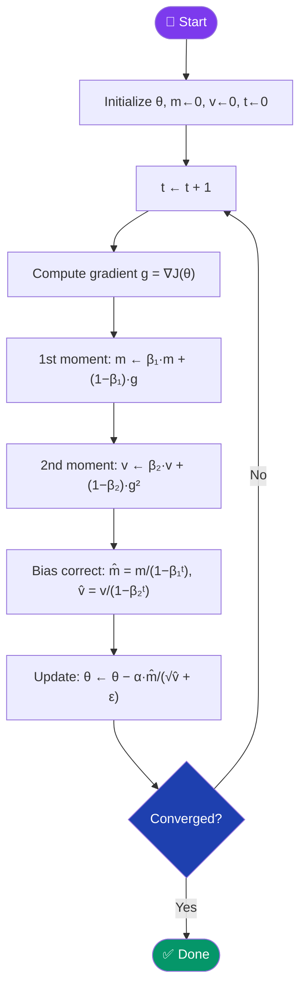
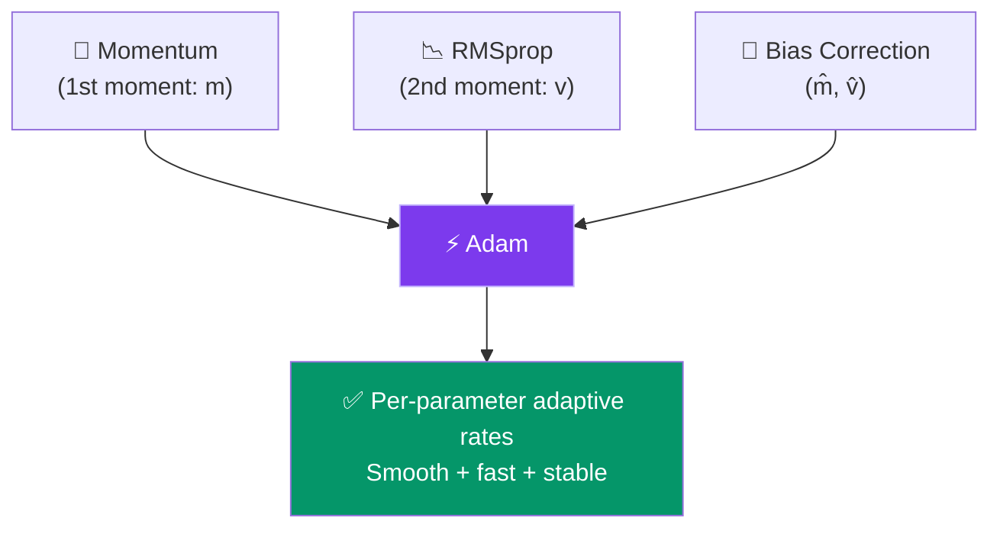

[← Back to README](../README.md)

# ⚡ Adam (Adaptive Moment Estimation)

> **Year Introduced:** 2015 &nbsp;|&nbsp; **Category:** Momentum & Adaptive Learning Rate Variants

---

## Overview

**Adam** (Adaptive Moment Estimation) is the most widely used optimizer in modern deep learning. It elegantly combines two powerful ideas: **Momentum** (first-moment estimation) and **RMSprop** (second-moment estimation), while adding **bias correction** to account for the zero-initialisation of moment estimates. The result is an optimizer that adapts learning rates per-parameter, smooths gradient updates, and corrects for early training instability.

Introduced by **Kingma & Ba (2015)** at ICLR, Adam has become the **industry-standard default** for training deep neural networks, transformers, and virtually every state-of-the-art model.

---

## ⚙️ How It Works

1. **Initialize** parameters θ, first moment m = 0, second moment v = 0, step counter t = 0.
2. **Compute gradient** g = ∇J(θ).
3. **Update first moment** (momentum): m ← β₁·m + (1−β₁)·g
4. **Update second moment** (RMSprop): v ← β₂·v + (1−β₂)·g²
5. **Bias-correct** both moments: m̂ = m/(1−β₁ᵗ), v̂ = v/(1−β₂ᵗ)
6. **Update parameters**: θ ← θ − α · m̂ / (√v̂ + ε)
7. **Increment** t. Repeat.

The bias correction in steps 5 is crucial — without it, the initialised m=v=0 vectors would cause artificially small updates in early training steps.

---

## 📐 Mathematical Formula

**First moment (momentum):**
$$m_{t} = \beta_1 \cdot m_{t-1} + (1 - \beta_1) \cdot g_t$$

**Second moment (RMS):**
$$v_{t} = \beta_2 \cdot v_{t-1} + (1 - \beta_2) \cdot g_t^2$$

**Bias-corrected estimates:**
$$\hat{m}_t = \frac{m_t}{1 - \beta_1^t} \qquad \hat{v}_t = \frac{v_t}{1 - \beta_2^t}$$

**Parameter update:**
$$\theta_{t+1} = \theta_t - \frac{\alpha}{\sqrt{\hat{v}_t} + \varepsilon} \cdot \hat{m}_t$$

**Default hyperparameters** (as recommended by Kingma & Ba):
- $\alpha = 0.001$
- $\beta_1 = 0.9$ (first moment decay)
- $\beta_2 = 0.999$ (second moment decay)
- $\varepsilon = 10^{-8}$

---

## 🔄 Algorithm Flow

---

## 🧩 Adam = Momentum + RMSprop + Bias Correction

---

## ✅ Pros

| Advantage | Detail |
|---|---|
| **Per-parameter adaptive rates** | Each weight gets its own tailored learning rate. |
| **Robust to gradient noise** | Momentum smooths oscillations; RMS normalises scale. |
| **Bias-corrected** | Reliable from the very first training step. |
| **Minimal tuning** | Default hyperparameters work well across most architectures. |
| **Universal applicability** | Transformers, CNNs, RNNs, GNNs — all trained with Adam. |

---

## ❌ Cons

| Disadvantage | Detail |
|---|---|
| **Weight decay coupling** | L2 regularization is not properly decoupled (see AdamW). |
| **Can converge to sharp minima** | May generalise worse than SGD+Momentum on some tasks. |
| **Memory overhead** | Stores two moment vectors (m and v), doubling memory vs SGD. |
| **Can diverge** | In rare cases (with certain learning rates), Adam can diverge. |

---

## 🎯 When to Use

- ✔️ **Any deep learning model** as the default first choice
- ✔️ **Transformers / LLMs** — Adam and AdamW are the standard
- ✔️ **CNNs, RNNs, GANs** — robust across architectures
- ✔️ **When you want fast results** without hyperparameter tuning
- ✖️ **Consider AdamW** when training large transformers (proper weight decay)
- ✖️ **Consider SGD+Momentum** for final fine-tuning on image classification

---

## 📖 First Paper / Origin

> **Kingma, D. P., & Ba, J. (2015).** *Adam: A Method for Stochastic Optimization.*
> Proceedings of the 3rd International Conference on Learning Representations (ICLR 2015).
>
> 🔗 [Read on arXiv](https://arxiv.org/abs/1412.6980)

One of the most cited papers in all of machine learning, with over 100,000 citations. Kingma and Ba derived Adam by combining the best properties of Adagrad and RMSprop, with the critical addition of bias-corrected moment estimates.

---

## 🔗 Related Variants

- [Weight Decay (AdamW)](./weight-decay-adamw.md) — the improved version of Adam for transformers
- [RMSprop](./rmsprop.md) — Adam's second-moment precursor
- [Momentum](./momentum.md) — Adam's first-moment precursor
- [Adagrad](./adagrad.md) — the adaptive rate inspiration for Adam
