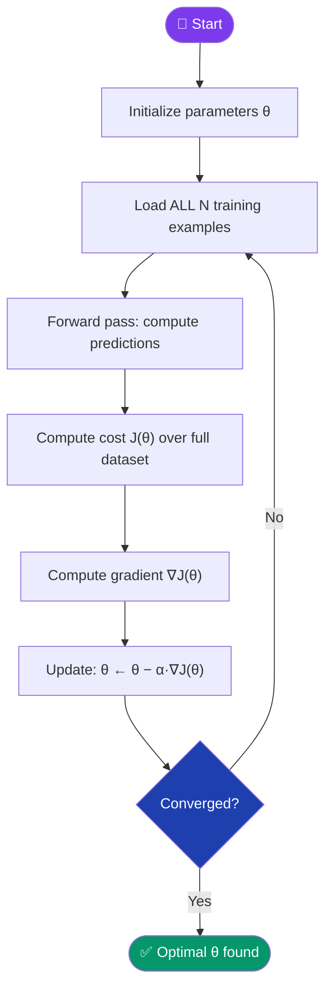

[← Back to README](../README.md)

# 📦 Batch Gradient Descent (Vanilla)

> **Year Introduced:** 1847 &nbsp;|&nbsp; **Category:** Data-Batching Variants

---

## Overview

**Batch Gradient Descent** (also called *Vanilla Gradient Descent*) is the classical, foundational form of gradient descent. It computes the gradient of the cost function with respect to **all** training examples simultaneously, then performs a single parameter update. It is the simplest and most mathematically pure form of gradient descent — but comes with significant computational costs in the modern era of large datasets.

The algorithm dates to **Augustin-Louis Cauchy (1847)**, who proposed steepest descent as a general technique for solving systems of equations.

---

## ⚙️ How It Works

1. **Initialize** model parameters θ randomly (or with zeros).
2. **Forward pass**: compute predictions for the **entire** training dataset.
3. **Compute the cost** J(θ) over all N training examples.
4. **Compute gradients** ∇J(θ) by differentiating the cost w.r.t. every parameter.
5. **Update parameters**: θ ← θ − α · ∇J(θ)
6. **Repeat** steps 2–5 until convergence (cost stops decreasing significantly).

Each full pass through the dataset is called an **epoch**.

---

## 📐 Mathematical Formula

The parameter update rule:

$$\theta_{t+1} = \theta_t - \alpha \cdot \nabla_\theta J(\theta_t)$$

Where:
- $\theta_t$ — model parameters at step $t$
- $\alpha$ — learning rate (step size)
- $J(\theta)$ — cost function averaged over **all** N training examples:

$$J(\theta) = \frac{1}{N} \sum_{i=1}^{N} \mathcal{L}(f(x^{(i)}; \theta),\, y^{(i)})$$

The gradient:

$$\nabla_\theta J(\theta) = \frac{1}{N} \sum_{i=1}^{N} \nabla_\theta \mathcal{L}(f(x^{(i)}; \theta),\, y^{(i)})$$

---

## 🔄 Algorithm Flow

---

## ✅ Pros

| Advantage | Detail |
|---|---|
| **Stable convergence** | Gradient is exact — no random noise — so the loss descends smoothly every epoch. |
| **Deterministic** | Given the same initialization, results are perfectly reproducible. |
| **Guaranteed descent** | With a correctly tuned learning rate, cost is guaranteed to decrease each step. |
| **Simple to implement** | No mini-batch shuffling or sampling logic required. |

---

## ❌ Cons

| Disadvantage | Detail |
|---|---|
| **Extremely slow on large datasets** | Must process all N examples every update — prohibitive when N is millions. |
| **High memory usage** | Entire dataset must fit in memory simultaneously. |
| **Cannot update on-the-fly** | Unsuitable for online or streaming learning scenarios. |
| **Can get stuck** | The smooth trajectory means it can sit in wide, flat saddle points. |

---

## 🎯 When to Use

- ✔️ **Small datasets** where full-batch computation is feasible
- ✔️ **Convex problems** where a smooth, guaranteed path to the global minimum is desirable
- ✔️ **Baseline benchmarking** — as a reference against more advanced optimizers
- ✔️ **Simple linear/logistic regression** tasks
- ✖️ **Avoid** for deep learning with large datasets (use SGD or Adam instead)

---

## 📖 First Paper / Origin

> **Cauchy, A.-L. (1847).** *Méthode générale pour la résolution des systèmes d'équations simultanées.*
> Comptes Rendus de l'Académie des Sciences, 25, 536–538.
>
> 🔗 [Read on Gallica (BnF)](https://gallica.bnf.fr/ark:/12148/bpt6k2982c/f540.item)

Cauchy introduced the method of steepest descent as a general technique for solving simultaneous equation systems, particularly applied to large quadratic problems in celestial mechanics.

---

## 🔗 Related Variants

- [Stochastic Gradient Descent (SGD)](./stochastic-gradient-descent.md) — processes one example at a time
- [Mini-Batch Gradient Descent](./mini-batch-gradient-descent.md) — processes small batches
- [Momentum](./momentum.md) — adds velocity to stabilise batch updates
- [Adam](./adam.md) — adaptive learning rates with moment estimation
