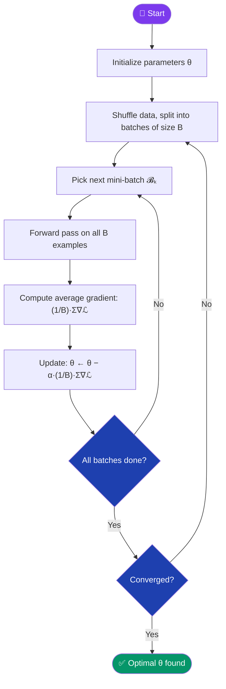
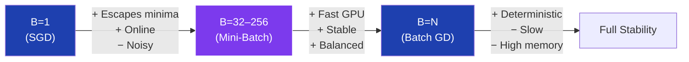

[← Back to README](../README.md)

# 🗂️ Mini-Batch Gradient Descent

> **Year Introduced:** ~1998 &nbsp;|&nbsp; **Category:** Data-Batching Variants

---

## Overview

**Mini-Batch Gradient Descent** is the *de facto* standard optimization approach in modern deep learning. It strikes the ideal balance between the stability of Batch GD and the speed of SGD by computing gradients over a **small, randomly sampled subset** (a "mini-batch") of the training data — typically 16 to 512 examples.

The term was popularised in the deep learning community by **LeCun et al. (1998)** in the landmark paper *Efficient BackProp*, and has since become the universal default for training neural networks.

---

## ⚙️ How It Works

1. **Initialize** parameters θ.
2. **Shuffle** the entire dataset randomly.
3. **Split** the data into mini-batches of size $B$ (e.g., 32, 64, 128, 256).
4. **For each mini-batch** $\mathcal{B}_k$:
   - Compute predictions and loss for all $B$ examples.
   - Average the gradients across the batch.
   - Update θ with the averaged gradient.
5. **One full pass** through all mini-batches = one **epoch**.
6. **Repeat** for multiple epochs until converged.

---

## 📐 Mathematical Formula

Parameter update rule:

$$\theta_{t+1} = \theta_t - \alpha \cdot \frac{1}{B} \sum_{i \in \mathcal{B}_k} \nabla_\theta \mathcal{L}(f(x^{(i)}; \theta_t),\, y^{(i)})$$

Where:
- $B$ — mini-batch size (hyperparameter)
- $\mathcal{B}_k$ — the $k$-th mini-batch of $B$ randomly selected examples
- $\alpha$ — learning rate

Special cases:
- $B = 1$ → Stochastic Gradient Descent
- $B = N$ → Batch Gradient Descent

---

## 🔄 Algorithm Flow

---

## 📊 Batch Size Trade-offs

---

## ✅ Pros

| Advantage | Detail |
|---|---|
| **GPU-friendly** | Batches enable highly optimised BLAS/CUDA tensor operations. |
| **Reduced variance** | Averaging over B examples gives smoother gradients than pure SGD. |
| **Faster than Batch GD** | N/B updates per epoch — much more frequent than a single update. |
| **Good convergence** | Balances noise (exploration) with accuracy (exploitation). |

---

## ❌ Cons

| Disadvantage | Detail |
|---|---|
| **Extra hyperparameter** | Batch size $B$ must be tuned; wrong values slow training or reduce generalisation. |
| **Memory proportional to B** | Larger batches need more GPU VRAM. |
| **Sharp minima risk** | Very large batches can converge to sharp, poorly-generalising minima. |

---

## 🎯 When to Use

- ✔️ **Deep neural networks** of any kind — this is the universal standard
- ✔️ **GPU training** — batch operations massively outperform single-sample loops
- ✔️ **Any dataset larger than ~10k examples**
- ✔️ **When combined with Adam, RMSprop, or Momentum** for best results
- ✖️ **Avoid** on tiny datasets — Batch GD is simpler and exact

---

## 📖 First Paper / Origin

> **LeCun, Y., Bottou, L., Orr, G. B., & Müller, K.-R. (1998).** *Efficient BackProp.*
> In G. Montavon et al. (Eds.), Neural Networks: Tricks of the Trade, Lecture Notes in Computer Science, vol. 1524.
>
> 🔗 [Read PDF](http://yann.lecun.com/exdb/publis/pdf/lecun-98b.pdf)

LeCun et al. formalised the practical advantages of mini-batching, showing empirically and theoretically why small batches are optimal for neural network training on real hardware.

---

## 🔗 Related Variants

- [Batch Gradient Descent](./batch-gradient-descent.md) — full dataset per update
- [Stochastic Gradient Descent](./stochastic-gradient-descent.md) — single example per update
- [Adam](./adam.md) — the most popular optimizer built on top of mini-batch updates
- [RMSprop](./rmsprop.md) — adaptive rates that complement mini-batching well
