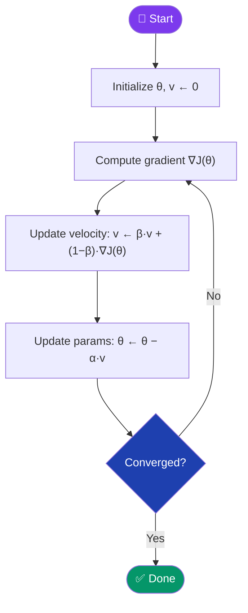
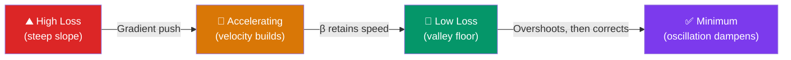

[← Back to README](../README.md)

# 🔵 Momentum

> **Year Introduced:** 1964 &nbsp;|&nbsp; **Category:** Momentum & Adaptive Learning Rate Variants

---

## Overview

**Momentum** (also known as the *Heavy-Ball Method*) is one of the most impactful improvements to gradient descent. Inspired by Newtonian physics, it accumulates a velocity vector in the direction of persistent gradient descent, causing the optimizer to accelerate in consistent directions and dampen oscillations in directions of high curvature.

Published by **Boris Polyak (1964)**, the method dramatically improves convergence on ill-conditioned problems — such as elongated loss bowls — that cause plain gradient descent to oscillate.

---

## ⚙️ How It Works

Instead of updating parameters directly from the gradient, Momentum maintains a **velocity** (or momentum) vector $v$ that accumulates a weighted sum of past gradients:

1. **Initialize** parameters θ and velocity v = 0.
2. **Compute gradient** ∇J(θ) on the current batch.
3. **Update velocity**: blend previous velocity with the new gradient.
4. **Update parameters**: move in the direction of the velocity vector.
5. **Repeat** until convergence.

The momentum term $\beta$ (typically 0.9) controls how much of the previous velocity is retained.

---

## 📐 Mathematical Formula

**Velocity update:**
$$v_{t+1} = \beta \cdot v_t + (1 - \beta) \cdot \nabla_\theta J(\theta_t)$$

**Parameter update:**
$$\theta_{t+1} = \theta_t - \alpha \cdot v_{t+1}$$

Alternative (classic Polyak formulation):
$$\theta_{t+1} = \theta_t - \alpha \cdot \nabla J(\theta_t) + \beta \cdot (\theta_t - \theta_{t-1})$$

Where:
- $v_t$ — velocity (exponential moving average of gradients)
- $\beta$ — momentum coefficient (typically 0.9)
- $\alpha$ — learning rate

---

## 🔄 Algorithm Flow

---

## 🏔️ Intuition: The Rolling Ball

---

## ✅ Pros

| Advantage | Detail |
|---|---|
| **Faster convergence** | Accelerates in consistent gradient directions — fewer epochs needed. |
| **Dampens oscillations** | Smooths out the noisy zig-zagging of vanilla SGD. |
| **Better navigation of ravines** | Builds speed along long, narrow loss landscapes. |
| **Simple addition** | Only one extra hyperparameter (β) with a robust default (0.9). |

---

## ❌ Cons

| Disadvantage | Detail |
|---|---|
| **Can overshoot** | Velocity builds up and may carry the optimizer past the minimum. |
| **Requires tuning β** | Wrong momentum coefficient can slow convergence or cause divergence. |
| **Lags in sharp turns** | Accumulated velocity makes it slow to respond to sudden gradient direction changes. |

---

## 🎯 When to Use

- ✔️ **Deep networks** with high-curvature or ill-conditioned loss surfaces
- ✔️ **Recurrent neural networks (RNNs)** — momentum helps stabilise training
- ✔️ **When vanilla SGD converges too slowly or oscillates**
- ✔️ **As a building block** inside more advanced optimizers (Adam includes momentum)
- ✖️ **Avoid** in convex problems with strong curvature where overshooting is costly

---

## 📖 First Paper / Origin

> **Polyak, B. T. (1964).** *Some methods of speeding up the convergence of iteration methods.*
> USSR Computational Mathematics and Mathematical Physics, 4(5), 1–17.
>
> 🔗 [View on ScienceDirect](https://doi.org/10.1016/0041-5553(64)90137-5)

Polyak introduced the heavy-ball method, showing that adding a fraction of the previous step to the current update significantly accelerates convergence on quadratic objectives, with provably optimal convergence rates.

---

## 🔗 Related Variants

- [Nesterov Accelerated Gradient](./nesterov-accelerated-gradient.md) — look-ahead variant of Momentum
- [SGD](./stochastic-gradient-descent.md) — Momentum is most impactful on top of SGD
- [Adam](./adam.md) — first moment of Adam is essentially momentum
- [RMSprop](./rmsprop.md) — second-order adaptive extension
