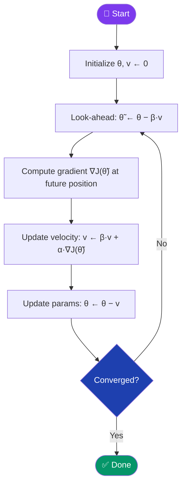
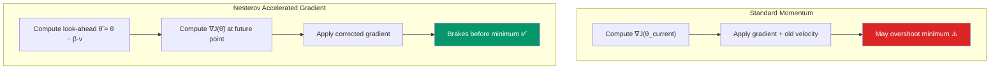

[← Back to README](../README.md)

# 🔭 Nesterov Accelerated Gradient (NAG)

> **Year Introduced:** 1983 &nbsp;|&nbsp; **Category:** Momentum & Adaptive Learning Rate Variants

---

## Overview

**Nesterov Accelerated Gradient (NAG)** is a smarter variant of Momentum that introduces a *look-ahead* mechanism. Rather than computing the gradient at the **current** position and then applying momentum, NAG computes the gradient at the **approximate future position** (where the momentum would take us). This gives the optimizer a chance to "apply the brakes" before arriving at a minimum, preventing overshoot.

Published by **Yurii Nesterov (1983)**, this method achieves the theoretically optimal convergence rate of $O(1/k^2)$ for smooth convex functions — a fundamental improvement over the $O(1/k)$ of plain gradient descent.

---

## ⚙️ How It Works

1. **Initialize** parameters θ and velocity v = 0.
2. **Look ahead**: compute the interim position θ̃ = θ − β·v (where momentum would take us).
3. **Compute gradient** at the look-ahead position: ∇J(θ̃).
4. **Update velocity**: v ← β·v + α·∇J(θ̃)
5. **Update parameters**: θ ← θ − v
6. **Repeat** until convergence.

The key difference from standard Momentum: the gradient is evaluated **ahead of the current position**, allowing the optimizer to anticipate and correct course.

---

## 📐 Mathematical Formula

**Look-ahead position:**
$$\tilde{\theta}_t = \theta_t - \beta \cdot v_t$$

**Velocity update:**
$$v_{t+1} = \beta \cdot v_t + \alpha \cdot \nabla_\theta J(\tilde{\theta}_t)$$

**Parameter update:**
$$\theta_{t+1} = \theta_t - v_{t+1}$$

Where:
- $\beta$ — momentum coefficient (typically 0.9)
- $\tilde{\theta}_t$ — look-ahead (interim) position
- $\alpha$ — learning rate

---

## 🔄 Algorithm Flow

---

## 🔭 NAG vs Momentum: The Key Difference

---

## ✅ Pros

| Advantage | Detail |
|---|---|
| **Optimal convergence rate** | Achieves $O(1/k^2)$ for smooth convex functions — provably optimal. |
| **Smarter than Momentum** | Look-ahead prevents overshooting at valley bottoms. |
| **Better on RNNs** | Sutskever et al. (2013) showed NAG significantly helps RNN training. |
| **Same cost as Momentum** | One extra gradient evaluation at a shifted position — negligible overhead. |

---

## ❌ Cons

| Disadvantage | Detail |
|---|---|
| **Harder to implement** | Requires evaluating gradient at a shifted position, not straightforward in frameworks. |
| **Still requires β tuning** | Momentum coefficient must be chosen carefully. |
| **Less common in practice** | Adam typically outperforms NAG on deep learning tasks. |

---

## 🎯 When to Use

- ✔️ **Convex optimization** problems where theoretical guarantees matter
- ✔️ **RNNs and LSTMs** where Sutskever et al. demonstrated clear gains
- ✔️ **When Momentum overshoots** and you need more careful convergence
- ✔️ **Research contexts** requiring optimal convergence rate proofs
- ✖️ **Avoid** for general deep learning — Adam/AdamW are more practical defaults

---

## 📖 First Paper / Origin

> **Nesterov, Y. (1983).** *A method for solving the convex programming problem with convergence rate O(1/k²).*
> Doklady Akademii Nauk SSSR (Soviet Mathematics Doklady), 269(3), 543–547.
>
> 🔗 [View on Semantic Scholar](https://www.semanticscholar.org/paper/A-method-for-solving-the-convex-programming-problem-Nesterov/573ea6f73e10d93b1b4c48f2c7a6e4f35b6e8e6)

Nesterov proved that his look-ahead method achieves the theoretically optimal convergence rate for first-order methods on smooth convex functions — a result that remains fundamental to optimization theory.

---

## 🔗 Related Variants

- [Momentum](./momentum.md) — the predecessor that NAG improves upon
- [Adam](./adam.md) — incorporates first-moment (momentum) estimates
- [Adagrad](./adagrad.md) — independent adaptive rate approach
- [SGD](./stochastic-gradient-descent.md) — the base optimizer NAG is applied to
