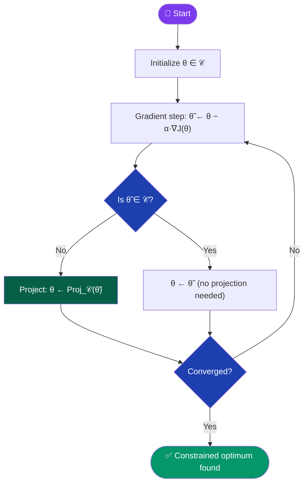
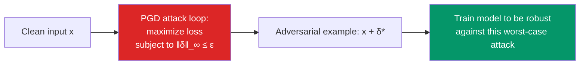

[← Back to README](../README.md)

# 🎯 Projected Gradient Descent (PGD)

> **Year Introduced:** 1964 &nbsp;|&nbsp; **Category:** Regularized & Constraints Variants

---

## Overview

**Projected Gradient Descent (PGD)** extends standard gradient descent to handle **constrained optimization** — problems where parameters must remain within a defined feasible set $\mathcal{C}$ (e.g., a ball, simplex, non-negative orthant). After each gradient step, parameters are **projected back** onto the feasible set if the update has moved them outside the allowed region.

Formally introduced by **Goldstein (1964)** as the "gradient projection method," PGD has found applications in physical systems modelling, adversarial machine learning (Madry et al., 2018), and any optimization problem with hard constraints.

---

## ⚙️ How It Works

1. **Initialize** parameters θ ∈ 𝒞 (within the feasible set).
2. **Gradient step**: take a standard gradient step: θ̃ ← θ − α·∇J(θ).
3. **Projection step**: if θ̃ ∉ 𝒞, project back: θ ← Proj_𝒞(θ̃).
4. **Repeat** until convergence.

The **projection** $\text{Proj}_\mathcal{C}(\tilde{\theta})$ finds the closest point in the feasible set to the unconstrained iterate:
$$\text{Proj}_\mathcal{C}(\tilde{\theta}) = \arg\min_{u \in \mathcal{C}} \|u - \tilde{\theta}\|_2^2$$

---

## 📐 Mathematical Formula

**Gradient step:**
$$\tilde{\theta}_{t+1} = \theta_t - \alpha \nabla_\theta J(\theta_t)$$

**Projection step:**
$$\theta_{t+1} = \text{Proj}_\mathcal{C}(\tilde{\theta}_{t+1}) = \arg\min_{u \in \mathcal{C}} \|u - \tilde{\theta}_{t+1}\|_2^2$$

**Common feasible sets and their projections:**

| Constraint Set | Projection Formula |
|---|---|
| $\ell_2$-ball: $\|\theta\|_2 \leq r$ | $\theta \cdot \min(1,\; r/\|\tilde\theta\|_2)$ |
| $\ell_\infty$-ball: $\|\theta\|_\infty \leq \epsilon$ | $\text{clip}(\tilde\theta,\, -\epsilon,\, +\epsilon)$ |
| Non-negative orthant: $\theta \geq 0$ | $\max(\tilde\theta, 0)$ (ReLU) |
| Probability simplex: $\theta \geq 0,\; \mathbf{1}^T\theta=1$ | Isotonic regression projection |

---

## 🔄 Algorithm Flow

---

## 🛡️ PGD in Adversarial Machine Learning

PGD gained major prominence in the adversarial ML community through **Madry et al. (2018)** — "Towards Deep Learning Models Resistant to Adversarial Attacks" — where PGD is used to find the **strongest adversarial perturbation** within an $\ell_\infty$-ball constraint:

---

## ✅ Pros

| Advantage | Detail |
|---|---|
| **Handles hard constraints** | Guarantees parameters always remain in feasible set $\mathcal{C}$. |
| **Simple structure** | Gradient + projection — clean two-step algorithm. |
| **Strong convergence theory** | Provable convergence for convex $J$ and convex $\mathcal{C}$. |
| **Versatile projections** | Many useful constraint sets have fast analytical projections. |

---

## ❌ Cons

| Disadvantage | Detail |
|---|---|
| **Projection can be expensive** | Some constraint sets (e.g., simplex, nuclear norm ball) require costly projections. |
| **Slow on complex problems** | Non-adaptive; much slower than Adam on unconstrained deep learning. |
| **Constraint set must be convex** | Projection theory breaks down for non-convex feasible sets. |

---

## 🎯 When to Use

- ✔️ **Adversarial training** — enforcing ε-ball perturbation constraints
- ✔️ **Physical system modelling** — parameters must obey physical bounds
- ✔️ **Non-negative matrix factorisation** — non-negativity constraint
- ✔️ **Probability simplex** — topic models, attention normalisation
- ✔️ **Reinforcement learning** — policy gradient methods with action space constraints
- ✖️ **Avoid** for unconstrained deep learning — far slower than Adam/AdamW

---

## 📖 First Paper / Origin

> **Goldstein, A. A. (1964).** *Convex programming in Hilbert space.*
> Bulletin of the American Mathematical Society, 70(5), 709–710.
>
> 🔗 [Read on AMS](https://doi.org/10.1090/S0002-9904-1964-11178-2)

Goldstein introduced the gradient projection method for constrained convex optimization in Hilbert space, establishing the foundational two-step (gradient + projection) iterative scheme.

---

## 🔗 Related Variants

- [Proximal Gradient Descent](./proximal-gradient-descent.md) — generalisation that handles non-smooth regularization
- [Batch Gradient Descent](./batch-gradient-descent.md) — the unconstrained base algorithm
- [Weight Decay (AdamW)](./weight-decay-adamw.md) — soft constraint via regularization
- [SGD](./stochastic-gradient-descent.md) — stochastic version applicable with projection steps
