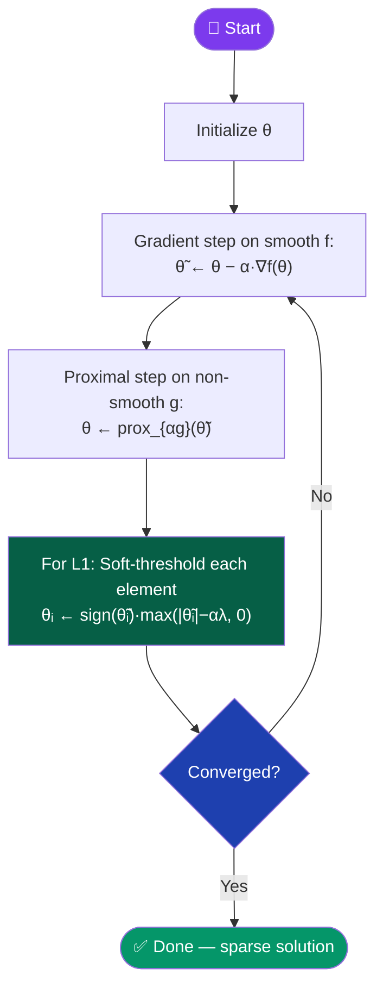
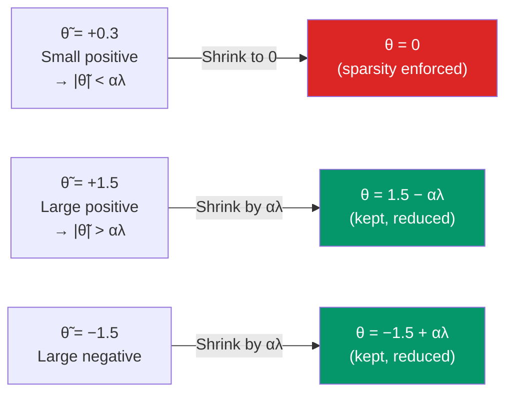

[← Back to README](../README.md)

# 🔧 Proximal Gradient Descent

> **Year Introduced:** 1979 &nbsp;|&nbsp; **Category:** Regularized & Constraints Variants

---

## Overview

**Proximal Gradient Descent** (also known as *Forward-Backward Splitting*) is designed for optimization problems where the objective function is a **sum of a smooth part and a non-smooth part** — such as L1 regularization (Lasso), total variation, or other non-differentiable penalties. Standard gradient descent cannot handle non-differentiable functions directly; the proximal operator provides an elegant geometric mapping that handles the non-smooth part separately.

The theoretical foundations trace to **Lions & Mercier (1979)** who established forward-backward splitting, and were later popularised for machine learning by Beck & Teboulle's **FISTA (2009)**.

---

## ⚙️ How It Works

The objective is split into two components:
$$\min_\theta \underbrace{f(\theta)}_{\text{smooth (differentiable)}} + \underbrace{g(\theta)}_{\text{non-smooth (e.g., L1)}}$$

1. **Initialize** parameters θ.
2. **Gradient step** on the smooth part: θ̃ ← θ − α·∇f(θ)
3. **Proximal step** on the non-smooth part: θ ← prox_{αg}(θ̃)
4. **Repeat** until convergence.

The **proximal operator** acts as a geometry-mapping projection that solves the non-smooth regularization problem in closed form.

---

## 📐 Mathematical Formula

**Objective decomposition:**
$$\min_\theta \; f(\theta) + g(\theta)$$

**Gradient step (smooth part):**
$$\tilde{\theta}_{t+1} = \theta_t - \alpha \nabla f(\theta_t)$$

**Proximal step (non-smooth part):**
$$\theta_{t+1} = \text{prox}_{\alpha g}(\tilde{\theta}_{t+1}) = \arg\min_u \left[ g(u) + \frac{1}{2\alpha} \|u - \tilde{\theta}_{t+1}\|^2 \right]$$

**For L1 regularization** $g(\theta) = \lambda\|\theta\|_1$, the proximal operator is **soft thresholding**:
$$[\text{prox}_{\alpha\lambda\|\cdot\|_1}(\tilde{\theta})]_i = \text{sign}(\tilde{\theta}_i) \cdot \max(|\tilde{\theta}_i| - \alpha\lambda, 0)$$

---

## 🔄 Algorithm Flow

---

## 🔬 Soft Thresholding (L1 Proximal Operator)

---

## ✅ Pros

| Advantage | Detail |
|---|---|
| **Handles non-smooth objectives** | Exactly solves L1, L∞, and other non-differentiable penalties. |
| **Produces sparse solutions** | L1 proximal operator zeros out small weights — ideal for Lasso/feature selection. |
| **Convergence guarantees** | Strong convergence theory for convex objectives (FISTA achieves O(1/k²)). |
| **Modular** | Smooth and non-smooth parts handled independently — easy to compose. |

---

## ❌ Cons

| Disadvantage | Detail |
|---|---|
| **Requires closed-form prox** | Proximal operator must be analytically tractable for the regularizer. |
| **Smooth part must be differentiable** | If f is also non-smooth, splitting alone won't work. |
| **Slower than Adam** | Not adaptive — slower on complex deep learning tasks. |

---

## 🎯 When to Use

- ✔️ **Lasso regression** (L1 regularization) — canonical use case
- ✔️ **Compressed sensing** and **sparse recovery** problems
- ✔️ **Signal processing** — total variation minimisation, wavelet sparsity
- ✔️ **Structured regularization** — group Lasso, nuclear norm minimisation
- ✖️ **Avoid** for standard deep learning — Adam/AdamW are faster and simpler

---

## 📖 First Paper / Origin

> **Lions, P.-L., & Mercier, B. (1979).** *Splitting algorithms for the sum of two nonlinear operators.*
> SIAM Journal on Numerical Analysis, 16(6), 964–979.
>
> 🔗 [Read on SIAM](https://doi.org/10.1137/0716071)

Lions and Mercier established the forward-backward splitting algorithm — the foundation of modern proximal gradient methods — proving convergence for monotone operator inclusions, which encompasses convex minimization as a special case.

---

## 🔗 Related Variants

- [Projected Gradient Descent](./projected-gradient-descent.md) — handles hard constraints (projection onto feasible sets)
- [Weight Decay (AdamW)](./weight-decay-adamw.md) — another regularization-aware optimizer
- [Batch Gradient Descent](./batch-gradient-descent.md) — the base optimizer on top of which proximal steps are applied
- [Adam](./adam.md) — adaptive alternative for deep learning
