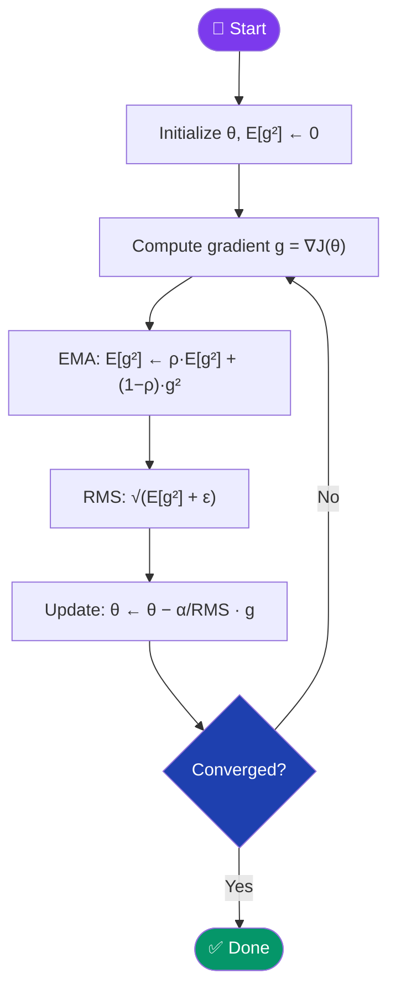
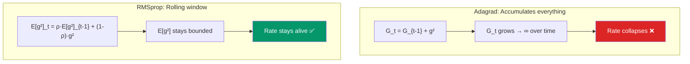

[← Back to README](../README.md)

# 📉 RMSprop (Root Mean Squared Propagation)

> **Year Introduced:** 2012 &nbsp;|&nbsp; **Category:** Momentum & Adaptive Learning Rate Variants

---

## Overview

**RMSprop** (Root Mean Squared Propagation) is an adaptive learning-rate optimizer designed to fix Adagrad's critical flaw: the monotonically shrinking learning rate. Rather than accumulating **all** historical squared gradients (as Adagrad does), RMSprop uses an **exponential moving average** — "forgetting" the distant past and keeping only recent gradient history. This allows the effective learning rate to remain active indefinitely.

RMSprop was introduced informally by **Geoffrey Hinton** in 2012 via Coursera lecture slides — making it one of the rare influential algorithms never published in a formal paper.

---

## ⚙️ How It Works

1. **Initialize** parameters θ, and a running mean-squared gradient cache E[g²] = 0.
2. **Compute gradient** g = ∇J(θ).
3. **Update exponential moving average of squared gradients**: E[g²] ← ρ·E[g²] + (1−ρ)·g²
4. **Compute the RMS of past gradients**: RMS[g] = √(E[g²] + ε)
5. **Update parameters**: θ ← θ − (α / RMS[g]) ⊙ g
6. **Repeat** — unlike Adagrad, E[g²] is bounded and doesn't grow to infinity.

The decay factor ρ (typically 0.9) controls how quickly older gradients are forgotten.

---

## 📐 Mathematical Formula

**Exponential moving average of squared gradients:**
$$E[g^2]_t = \rho \cdot E[g^2]_{t-1} + (1 - \rho) \cdot g_t^2$$

**Parameter update:**
$$\theta_{t+1} = \theta_t - \frac{\alpha}{\sqrt{E[g^2]_t + \varepsilon}} \cdot g_t$$

Where:
- $E[g^2]_t$ — exponential moving average of squared gradients (per-parameter)
- $\rho$ — decay rate (typically 0.9); controls the "memory window"
- $g_t = \nabla_\theta J(\theta_t)$ — gradient at step $t$
- $\varepsilon \approx 10^{-8}$ — numerical stability constant
- $\alpha$ — base learning rate (typically 0.001)

---

## 🔄 Algorithm Flow

---

## ⚖️ Adagrad vs RMSprop

---

## ✅ Pros

| Advantage | Detail |
|---|---|
| **Solves Adagrad's decay** | Exponential averaging keeps the effective learning rate alive. |
| **Works well on non-convex** | Good performance on deep networks and RNNs. |
| **Per-parameter adaptation** | Each weight gets its own tailored learning rate. |
| **Hinton's recommended default** | ρ=0.9, α=0.001, ε=1e-8 are well-established defaults. |

---

## ❌ Cons

| Disadvantage | Detail |
|---|---|
| **No bias correction** | Unlike Adam, RMSprop doesn't correct for initialisation bias. |
| **No momentum** | Pure second-moment adaptation; no first-moment (momentum) term. |
| **Hyperparameter sensitivity** | ρ and α choices can significantly affect stability. |
| **Never formally published** | Difficult to cite formally; algorithm details vary across implementations. |

---

## 🎯 When to Use

- ✔️ **RNNs and LSTMs** — Hinton originally developed it for this purpose
- ✔️ **Non-stationary objectives** — problems where gradient statistics shift over time
- ✔️ **Online learning** with non-convex losses
- ✔️ **When Adam is too aggressive** but Adagrad is too decaying
- ✖️ **Avoid** for state-of-the-art results — Adam/AdamW are generally superior

---

## 📖 First Paper / Origin

> **Hinton, G., Srivastava, N., & Swersky, K. (2012).** *Neural Networks for Machine Learning — Lecture 6e: RMSProp.*
> Coursera, University of Toronto.
>
> 🔗 [Original Lecture Slides (Toronto)](https://www.cs.toronto.edu/~tijmen/csc321/slides/lecture_slides_lec6.pdf)

RMSprop is unusual in that it was introduced through a Coursera course, not a peer-reviewed paper. It was presented as a practical fix to Adagrad's vanishing-rate problem for training deep networks.

---

## 🔗 Related Variants

- [Adagrad](./adagrad.md) — the predecessor RMSprop improves upon
- [Adam](./adam.md) — combines RMSprop (2nd moment) with Momentum (1st moment)
- [Momentum](./momentum.md) — the first-moment component Adam adds to RMSprop
- [Mini-Batch GD](./mini-batch-gradient-descent.md) — the batching strategy RMSprop is applied on top of
