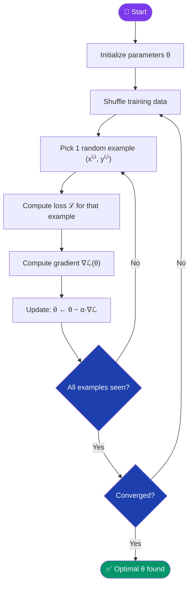

[← Back to README](../README.md)

# ⚡ Stochastic Gradient Descent (SGD)

> **Year Introduced:** 1951 &nbsp;|&nbsp; **Category:** Data-Batching Variants

---

## Overview

**Stochastic Gradient Descent (SGD)** is the high-speed, high-variance counterpart to Batch Gradient Descent. Instead of computing gradients over the entire dataset, SGD uses **a single randomly selected training example** per update step. This makes each update extremely fast and allows the model to start learning immediately — but introduces significant noise into the optimization trajectory.

The theoretical foundations trace back to **Robbins & Monro (1951)** who published the stochastic approximation framework, which SGD directly embodies.

---

## ⚙️ How It Works

1. **Initialize** parameters θ.
2. **Shuffle** the training dataset randomly.
3. **For each training example** (x⁽ⁱ⁾, y⁽ⁱ⁾):
   - Compute the prediction and loss for **this single example**.
   - Compute the gradient of the loss w.r.t. θ.
   - Update parameters immediately.
4. **Repeat** for multiple epochs until convergence.

The key insight: because we sample randomly, the single-example gradient is a **noisy but unbiased estimate** of the true gradient.

---

## 📐 Mathematical Formula

Parameter update for the $i$-th training example:

$$\theta_{t+1} = \theta_t - \alpha \cdot \nabla_\theta \mathcal{L}(f(x^{(i)}; \theta_t),\, y^{(i)})$$

Where:
- $\theta_t$ — parameters at step $t$
- $\alpha$ — learning rate
- $\mathcal{L}$ — loss for a **single** example $(x^{(i)}, y^{(i)})$

Unlike Batch GD, the gradient here is computed over just one sample, so updates happen $N$ times per epoch rather than once.

---

## 🔄 Algorithm Flow

---

## ✅ Pros

| Advantage | Detail |
|---|---|
| **Very fast updates** | One gradient computation per step — starts learning immediately. |
| **Low memory usage** | Only one example held in memory at a time. |
| **Escapes local minima** | High variance noise can kick the optimizer out of shallow local minima. |
| **Online learning** | Can be updated continuously as new data streams in. |

---

## ❌ Cons

| Disadvantage | Detail |
|---|---|
| **Highly noisy trajectory** | Loss oscillates heavily — difficult to know when true convergence has been reached. |
| **Slow overall convergence** | High variance means many noisy steps are wasted in suboptimal directions. |
| **Learning rate sensitivity** | Requires careful scheduling; too large → diverge, too small → very slow. |
| **No GPU vectorisation benefit** | Processes one sample at a time — cannot exploit SIMD/tensor parallelism. |

---

## 🎯 When to Use

- ✔️ **Online / streaming learning** where data arrives continuously
- ✔️ **Very large datasets** where even a single epoch of BGD is infeasible
- ✔️ **Non-convex loss landscapes** where noise helps exploration
- ✔️ **Early training phases** to quickly approach the loss basin
- ✖️ **Avoid** where stable, reproducible convergence is required — use Mini-Batch or Adam

---

## 📖 First Paper / Origin

> **Robbins, H. & Monro, S. (1951).** *A Stochastic Approximation Method.*
> Annals of Mathematical Statistics, 22(3), 400–407.
>
> 🔗 [Read on Project Euclid](https://doi.org/10.1214/aoms/1177729586)

Robbins and Monro introduced the framework of stochastic approximation — iterative parameter updates using noisy observations — which is exactly the mechanism behind modern SGD.

---

## 🔗 Related Variants

- [Batch Gradient Descent](./batch-gradient-descent.md) — uses the full dataset per update
- [Mini-Batch Gradient Descent](./mini-batch-gradient-descent.md) — the best-of-both-worlds compromise
- [Momentum](./momentum.md) — smooths the noisy SGD trajectory
- [Adam](./adam.md) — adaptive rates that tame SGD's variance
