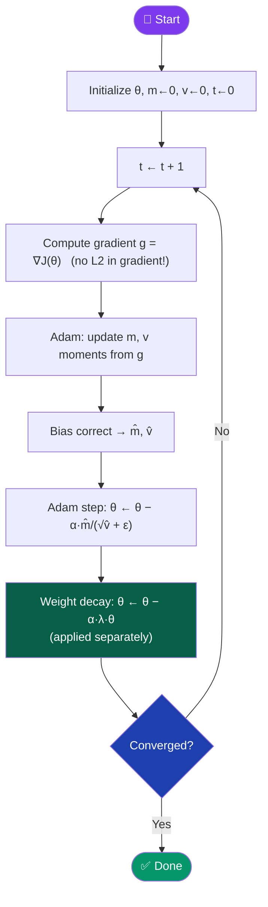
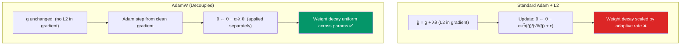

[← Back to README](../README.md)

# ⚖️ Weight Decay (AdamW / SGDW)

> **Year Introduced:** 2019 (AdamW paper) &nbsp;|&nbsp; **Category:** Regularized & Constraints Variants

---

## Overview

**Weight Decay** (implemented correctly as **AdamW** or **SGDW**) solves a subtle but critical problem: the incorrect coupling of L2 regularization and adaptive learning rates in Adam. In standard Adam, adding L2 regularization (by penalising large weights) effectively scales the regularization term by the adaptive learning rate, which corrupts the intended regularization effect. AdamW *decouples* weight decay from the gradient update, restoring the proper regularization behaviour.

Introduced by **Loshchilov & Hutter (2019)** at ICLR, AdamW has become the **de facto standard optimizer for training large language models and transformers** (GPT, BERT, T5, etc.).

---

## ⚙️ How It Works

**Standard Adam with L2 (incorrect for regularization):**
- Adds λθ to the gradient before updating: g̃ = g + λθ
- The regularization λθ is scaled by the adaptive rate — defeating its purpose

**AdamW (correct decoupling):**
1. Compute standard Adam update from gradient g (no L2 term in gradient).
2. **Separately** apply weight decay directly to the weights: θ ← θ · (1 − α·λ)
3. The decay is applied **before** the Adam update, independent of gradient magnitude.

This decoupling ensures weight decay functions correctly regardless of the scale of gradients.

---

## 📐 Mathematical Formula

**Standard Adam with L2 (❌ coupled):**
$$\theta_{t+1} = \theta_t - \frac{\alpha}{\sqrt{\hat{v}_t} + \varepsilon} \cdot (\hat{m}_t + \lambda \theta_t)$$

**AdamW (✅ decoupled):**
$$\theta_{t+1} = \theta_t - \alpha \left( \frac{\hat{m}_t}{\sqrt{\hat{v}_t} + \varepsilon} + \lambda \theta_t \right)$$

In AdamW, the weight decay $\lambda \theta_t$ is added **outside** the adaptive scaling factor $1/\sqrt{\hat{v}_t}$, so it is not distorted by the per-parameter learning rate.

Where:
- $\lambda$ — weight decay coefficient (typically 0.01–0.1)
- $\hat{m}_t$, $\hat{v}_t$ — bias-corrected Adam moment estimates
- $\alpha$ — base learning rate

---

## 🔄 Algorithm Flow

---

## ⚖️ Adam vs AdamW: The Key Difference

---

## ✅ Pros

| Advantage | Detail |
|---|---|
| **Correct regularization** | Decoupling ensures weight decay acts uniformly, not scaled by adaptive rate. |
| **Better generalisation** | Empirically produces better test accuracy than Adam+L2. |
| **Transformer-standard** | Used in GPT-2, GPT-3, BERT, T5, and virtually all modern LLMs. |
| **Same cost as Adam** | Negligible overhead over standard Adam. |

---

## ❌ Cons

| Disadvantage | Detail |
|---|---|
| **Extra hyperparameter** | Weight decay coefficient λ must be tuned. |
| **Memory same as Adam** | Still stores two moment vectors (2× SGD memory). |
| **Not always better** | On some computer vision tasks, SGD+Momentum still outperforms AdamW. |

---

## 🎯 When to Use

- ✔️ **Training transformers / LLMs** — the absolute standard choice
- ✔️ **Any task where regularization is important** to prevent overfitting
- ✔️ **Fine-tuning pre-trained models** — proper weight decay prevents catastrophic forgetting
- ✔️ **Replacing Adam** — almost always a safe upgrade
- ✖️ **Consider SGD+Momentum** for final CV benchmarks if AdamW generalises slightly worse

---

## 📖 First Paper / Origin

> **Loshchilov, I., & Hutter, F. (2019).** *Decoupled Weight Decay Regularization.*
> Proceedings of the International Conference on Learning Representations (ICLR 2019).
>
> 🔗 [Read on arXiv](https://arxiv.org/abs/1711.05101)

Loshchilov and Hutter demonstrated mathematically and empirically that L2 regularization and weight decay are only equivalent for standard SGD, and that their decoupling in AdamW consistently improves generalisation.

---

## 🔗 Related Variants

- [Adam](./adam.md) — the base optimizer AdamW improves
- [SGD](./stochastic-gradient-descent.md) — SGDW applies the same decoupling to SGD
- [Proximal Gradient Descent](./proximal-gradient-descent.md) — another regularization-aware optimizer
- [Momentum](./momentum.md) — combined with SGDW for competitive baselines
